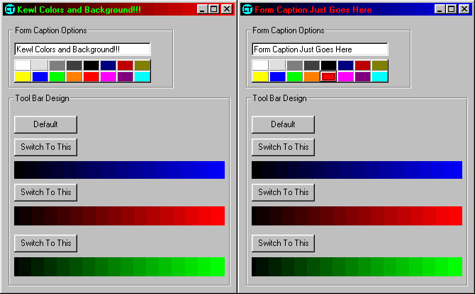



## Cool Tool Bar

### Description

This is a program that will allow you to change the color of the Forms Caption and instead of the dull blue color it will allow designs and stuff. If anyone has an API version please let me know! Thanks!!!
 
### More Info
 

             |
---                |---
**Submitted On**   |2000-07-21 20:53:02
**By**             |[Japeth Starlite](https://github.com/Planet-Source-Code/PSCIndex/blob/master/ByAuthor/japeth-starlite.md)
**Level**          |Beginner
**User Rating**    |3.7 (11 globes from 3 users)
**Compatibility**  |VB 6\.0
**Category**       |[Graphics](https://github.com/Planet-Source-Code/PSCIndex/blob/master/ByCategory/graphics__1-46.md)
**World**          |[Visual Basic](https://github.com/Planet-Source-Code/PSCIndex/blob/master/ByWorld/visual-basic.md)
**Archive File**   |[CODE\_UPLOAD80347222000\.zip](https://github.com/Planet-Source-Code/japeth-starlite-cool-tool-bar__1-9972/archive/master.zip)

